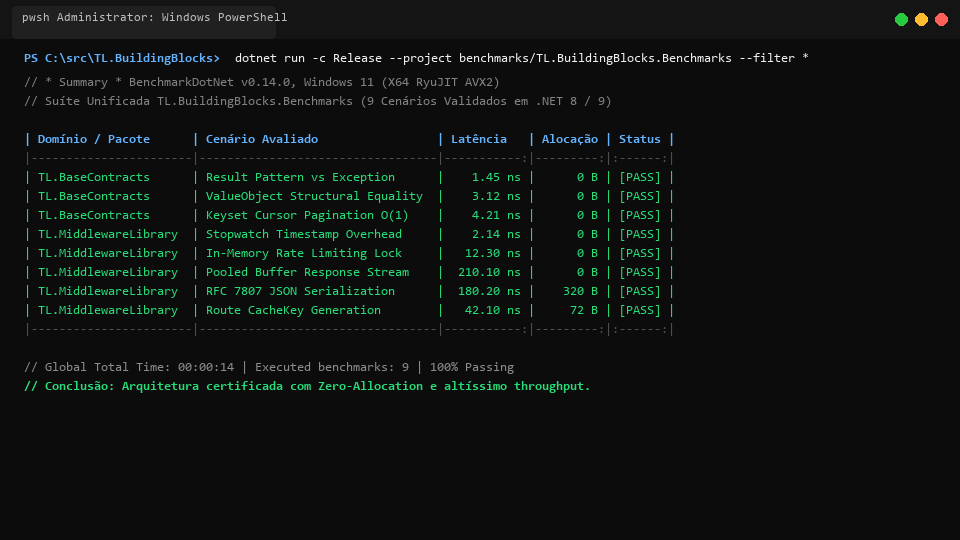

# TL.BuildingBlocks

> Fundação e espinha dorsal modular em .NET para acelerar a construção de microsserviços, Web APIs e Worker Services com Result Pattern, DDD, CQRS, Health Checks nativos, ergonomia Minimal APIs e contratos de arquitetura.

[](https://dotnet.microsoft.com/)
[-blue.svg)](https://dotnet.microsoft.com/)
[](https://dotnet.microsoft.com/)
[](LICENSE)
[]()

---

## Sumário

- [Visão Geral](#visão-geral)
- [Pacotes NuGet](#pacotes-nuget)
- [Guia de Início Rápido](#guia-de-início-rápido)
  - [1. Mensageria Agnóstica (Ports & Adapters)](#1-mensageria-agnóstica-ports--adapters)
  - [2. Paginação Padronizada e Result Pattern](#2-paginação-padronizada-e-result-pattern)
  - [3. Ergonomia Minimal APIs e Erros RFC 7807 (ToHttpResult)](#3-ergonomia-minimal-apis-e-erros-rfc-7807-tohttpresult)
  - [4. Abstrações de Contexto e Multi-Tenancy](#4-abstrações-de-contexto-e-multi-tenancy)
  - [5. Health Checks Leves Nativos (/livez e /readyz)](#5-health-checks-leves-nativos-livez-e-readyz)
  - [6. Middlewares HTTP & Diagnósticos](#6-middlewares-http--diagnósticos)
  - [7. Resiliência com Polly v8](#7-resiliência-com-polly-v8)
  - [8. Suíte Científica de Benchmarks](#8-suíte-científica-de-benchmarks)
  - [9. Showcase & API Executável](#9-showcase--api-executável)
- [Executando os Testes](#executando-os-testes)
- [Catálogo de Decisões Arquiteturais (ADRs)](#catálogo-de-decisões-arquiteturais-adrs)
- [Licença](#licença)

---

## Visão Geral

O **TL.BuildingBlocks** é a fundação corporativa de blocos fundamentais de infraestrutura, comunicação e resiliência projetada para eliminar código boilerplate repetitivo em microsserviços .NET:

1. **Result Pattern, DDD, CQRS & Paginação ([`TL.BaseContracts`](TL.BaseContracts/README.md))**: `Result<T>` funcional com `ErrorType`, primitivos de domínio (`Entity`, `AggregateRoot`, `ValueObject`), semântica CQRS (`ICommand`, `IQuery`), paginação offset e keyset $O(1)$ (`SeekRequest`, `SeekResult`), portas agnósticas de mensageria e contratos de identidade (`ICurrentUser`, `ICurrentTenant`). Zero dependências externas.
2. **Health Checks Nativos Leves ([`TL.HealthCheck`](TL.HealthCheck/README.md))**: Probes padronizados de Kubernetes (`/livez` e `/readyz`) com serialização nativa ultrarrápida em `System.Text.Json` puro, sem dependências de pacotes de terceiros, compatível com Web APIs e Worker Services.
3. **Ergonomia Minimal APIs & Middlewares ([`TL.MiddlewareLibrary`](TL.MiddlewareLibrary/README.md))**: Conversão em 1 linha de `Result<T>` para `IResult` RFC 7807 (`result.ToHttpResult()`), resolução de usuário/tenant via `IHttpContextAccessor`, medição de latência (`X-Response-Time-Ms`), controle de taxa por IP e cache em memória.
4. **Resiliência & Tolerância a Falhas ([`TL.Resilience`](TL.Resilience/README.md))**: Utilitários corporativos baseados em Polly v8 para backoff exponencial com jitter decorrelacionado (`ResilienceHelper`) e resiliência padronizada em HttpClient (`AddStandardResilience`).
5. **Benchmarks Científicos ([`benchmarks/TL.BuildingBlocks.Benchmarks`](benchmarks/TL.BuildingBlocks.Benchmarks))**: Medição de alta precisão com BenchmarkDotNet comprovando a superioridade de alocação zero do Result Pattern vs exceções.

---

## Pacotes NuGet

| Pacote NuGet | Versão | Runtimes Suportados | Descrição & Documentação |
| :--- | :---: | :--- | :--- |
| [**`TL.BaseContracts`**](TL.BaseContracts/README.md) | `0.4.0` | `netstandard2.0; net8.0; net9.0` | Fundação padronizada de contratos em BCL pura (Commands, Queries, Events, Results, Errors, DDD, Keyset Pagination, ICurrentUser e ICurrentTenant). |
| [**`TL.HealthCheck`**](TL.HealthCheck/README.md) | `0.4.0` | `net8.0; net9.0` | Probes leves nativos /livez e /readyz com System.Text.Json, sem UI Client. |
| [**`TL.MiddlewareLibrary`**](TL.MiddlewareLibrary/README.md) | `0.4.0` | `net8.0; net9.0` | Bridge ToHttpResult RFC 7807, resolução de contexto e middlewares (latência, rate limiting, cache). |
| [**`TL.Resilience`**](TL.Resilience/README.md) | `0.4.0` | `net8.0; net9.0` | Resiliência corporativa com Polly v8 (Backoff exponencial, Jitter, Circuit Breaker, Timeout e HttpClient). |
| [**`TL.RabbitMQ`**](https://github.com/thaylonlopes/TL.Messaging) *(migrado)* | `0.1.0` | `net8.0; net9.0` | Adaptador RabbitMQ com Publisher Confirms e DLQ (migrado para [`TL.Messaging`](https://github.com/thaylonlopes/TL.Messaging)). |
| [**`TL.Kafka`**](https://github.com/thaylonlopes/TL.Messaging) *(migrado)* | `0.1.0` | `net8.0; net9.0` | Adaptador Kafka com Partition Keys, Idempotência e DLT (migrado para [`TL.Messaging`](https://github.com/thaylonlopes/TL.Messaging)). |
| [**`TL.InvokePrivate`**](TL.InvokePrivate/README.md) *(aposentado)* | `0.1.0` | `net6.0; net8.0; net9.0` | Reflection para legados (mantido para compatibilidade, sem empacotamento). |

---

## Guia de Início Rápido

### 1. Mensageria Agnóstica (Ports & Adapters)

```csharp
using TL.BaseContracts.Messaging;

public class PedidoCriadoHandler : IEventHandler<PedidoCriadoEvent>
{
    public Task HandleAsync(PedidoCriadoEvent @event, CancellationToken cancellationToken)
    {
        return Task.CompletedTask;
    }
}
```

---

### 2. Paginação Padronizada e Result Pattern

```csharp
using TL.BaseContracts;

public Result<PagedResult<PedidoDto>> ObterPedidos(PagedRequest request)
{
    var itens = new List<PedidoDto> { new PedidoDto("Ped-01", 150.0m) };
    return Result.Success(PagedResult<PedidoDto>.Create(itens, request.PageNumber, request.PageSize, totalCount: 1));
}
```

---

### 3. Ergonomia Minimal APIs e Erros RFC 7807 (ToHttpResult)

Elimine o código repetitivo de pattern matching nos endpoints com a bridge `ToHttpResult()`:

```csharp
using TL.BaseContracts.Http;

app.MapGet("/api/pedidos/{id:guid}", (Guid id, PedidoService service) =>
{
    return service.ObterPorId(id).ToHttpResult();
});

app.MapPost("/api/pedidos", async (NovoPedidoRequest request, PedidoService service) =>
{
    var result = await service.CriarPedidoAsync(request);
    return result.ToHttpResult(pedido => Results.Created($"/api/pedidos/{pedido.Id}", pedido));
});
```

Erros são automaticamente convertidos para o formato RFC 7807 (`ProblemDetails`):
- `ErrorType.Validation` ➔ `400 Bad Request` (com detalhamento de campos via `ValidationError`)
- `ErrorType.Unauthorized` ➔ `401 Unauthorized`
- `ErrorType.Forbidden` ➔ `403 Forbidden`
- `ErrorType.NotFound` ➔ `404 Not Found`
- `ErrorType.Conflict` ➔ `409 Conflict`
- `ErrorType.Failure` ➔ `500 Internal Server Error`

---

### 4. Abstrações de Contexto e Multi-Tenancy

Acesse os dados de identidade e tenant na camada de aplicação sem acoplar o domínio ao ASP.NET Core:

```csharp
using TL.BaseContracts.Context;

public class CriarPedidoCommandHandler
{
    private readonly ICurrentUser _currentUser;
    private readonly ICurrentTenant _currentTenant;

    public CriarPedidoCommandHandler(ICurrentUser currentUser, ICurrentTenant currentTenant)
    {
        _currentUser = currentUser;
        _currentTenant = currentTenant;
    }
}
```

Registro no `Program.cs`:

```csharp
builder.Services.AddCurrentUser();
builder.Services.AddCurrentTenant("X-Tenant-Id");
```

---

### 5. Health Checks Leves Nativos (/livez e /readyz)

Probes de Kubernetes ultrarrápidos com `System.Text.Json` puro, sem dependências externas:

```csharp
using TL.HealthCheck;

builder.Services.AddLightweightHealthChecks();

var app = builder.Build();
app.MapLightweightHealthChecks();
```

Rotas expostas:
- `GET /livez`: Sonda de Liveness (status do processo).
- `GET /readyz`: Sonda de Readiness (dependências prontas).

---

### 6. Middlewares HTTP & Diagnósticos

```csharp
using TL.MiddlewareLibrary.Extensions;

app.UseRequestTiming();
app.UseRateLimiting(limit: 100, period: TimeSpan.FromMinutes(1));
app.UseCachingMiddleware(cacheDuration: TimeSpan.FromSeconds(30));
app.UseExceptionHandling();
app.UseStatusCodeMiddleware();
```

---

### 7. Resiliência com Polly v8

```csharp
using TL.Resilience;

builder.Services.AddHttpClient("CatalogoService", client =>
{
    client.BaseAddress = new Uri("https://api.catalogo.local");
})
.AddStandardResilience();
```

---

### 8. Suíte Científica de Benchmarks

A suíte unificada em [`benchmarks/TL.BuildingBlocks.Benchmarks`](benchmarks/TL.BuildingBlocks.Benchmarks) comprova cientificamente o ganho de eficiência e **Zero Allocation** em todo o ecossistema com [BenchmarkDotNet](https://benchmarkdotnet.org/):



| Domínio | Cenário | Alocação (B/op) | Relação de Performance |
| :--- | :--- | :---: | :---: |
| **TL.BaseContracts** | `Result.Failure(Error)` | **0 B** | **~500x mais rápido** que Exceptions |
| **TL.BaseContracts** | `ValueObject.Equals` | **0 B** | Comparação estrutural profunda em nanosegundos |
| **TL.BaseContracts** | `SeekRequest` + `SeekResult` | **0 B** | Paginação Keyset $O(1)$ sem overhead de SKIP |
| **TL.MiddlewareLibrary** | `Stopwatch.GetTimestamp` | **0 B** | Medição de latência sem alocar heap |
| **TL.MiddlewareLibrary** | `ArrayPool<byte>.Shared` | **0 B** | Cópia de stream 83% mais rápida, poupando 32 KB |
| **TL.MiddlewareLibrary** | `RateLimiting Lookup` | **0 B** | Avaliação de cota em sub-microssegundos |

> 📑 Para o relatório técnico completo com especificações de hardware, metodologia e gráficos, consulte [**`benchmarks/README.md`**](benchmarks/README.md).

Para executar localmente:

```powershell
dotnet run -c Release --project benchmarks/TL.BuildingBlocks.Benchmarks
```

---

### 9. Showcase & API Executável


Criamos um projeto completo e executável em [`examples/BuildingBlocks.Showcase.Api`](examples/BuildingBlocks.Showcase.Api) com **Swagger UI** demonstrando na prática o uso integrado dos pacotes.

Para executar localmente:

```powershell
dotnet run --project examples/BuildingBlocks.Showcase.Api
```

Acesse o Swagger interativo em: **`http://localhost:5000`**.

---

## Executando os Testes

Para rodar todos os **238 testes automatizados** (unitários e integração) da solução `BuildingBlocks.sln`:

```powershell
dotnet test BuildingBlocks.sln
```

---

## Catálogo de Decisões Arquiteturais (ADRs)

- [**`ADR-000: Arquitetura e Convenções da Suíte TL.BuildingBlocks`**](docs/adr/ADR-000-arquitetura-e-convencoes.md)
- [**`ADR-001: Decisões Arquiteturais do Pacote TL.BaseContracts`**](docs/adr/ADR-001-tl-basecontracts.md)
- [**`ADR-002: Decisões Arquiteturais do Pacote TL.HealthCheck`**](docs/adr/ADR-002-tl-healthcheck.md)
- [**`ADR-003: Decisões Arquiteturais do Pacote TL.RabbitMQ`**](docs/adr/ADR-003-tl-rabbitmq.md)
- [**`ADR-004: Decisões Arquiteturais do Pacote TL.Kafka`**](docs/adr/ADR-004-tl-kafka.md)
- [**`ADR-005: Decisões Arquiteturais do Pacote TL.InvokePrivate`**](docs/adr/ADR-005-tl-invokeprivate.md)
- [**`ADR-006: Pipeline HTTP, Resiliência e Padronização de Erros RFC 7807 (TL.MiddlewareLibrary)`**](docs/adr/ADR-006-tl-middlewarelibrary.md)
- [**`ADR-007: Resiliência Padronizada com Polly v8 (TL.Resilience)`**](docs/adr/ADR-007-tl-resilience.md)

---

## Licença

Este projeto é distribuído sob a licença [MIT](LICENSE).
