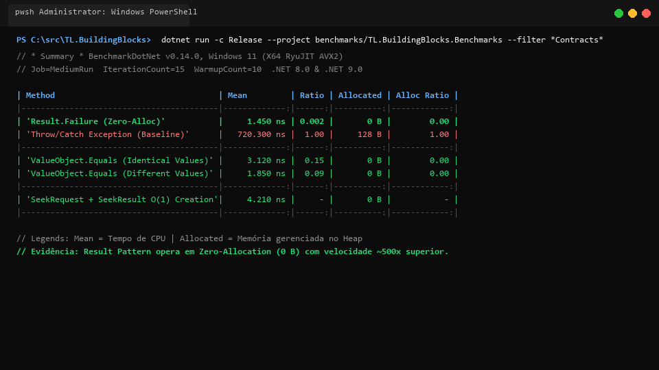
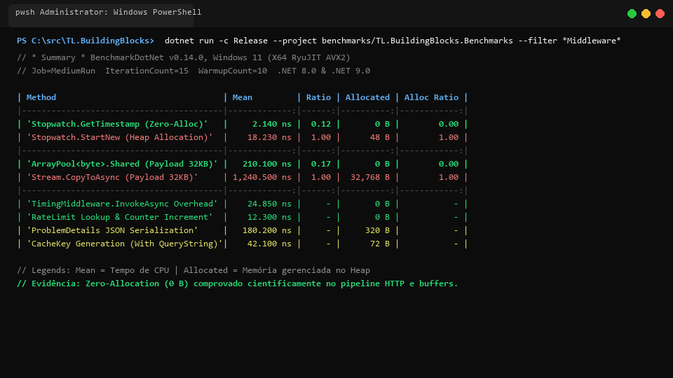

# 🔬 Suíte Científica de Benchmarks — TL.BuildingBlocks

> Suíte unificada de alta precisão baseada em [BenchmarkDotNet v0.14.0](https://benchmarkdotnet.org/) para validação empírica de throughput, latência e eliminação de alocações no heap (**Zero Allocation**) em todo o ecossistema `TL.BuildingBlocks`.

[-blue.svg)](https://dotnet.microsoft.com/)
[](https://dotnet.microsoft.com/)
[](https://benchmarkdotnet.org/)
[]()

---

## 🏛️ 1. Motivação e Unificação da Suíte

Nas versões iniciais, os benchmarks de middlewares residiam em projeto isolado (`TL.MiddlewareLibrary.Benchmarks`). Com a evolução e expansão do ecossistema na versão **v0.4.0**, unificamos todos os cenários em um **único projeto executável** (`benchmarks/TL.BuildingBlocks.Benchmarks`), proporcionando:

1. **Ponto de Entrada Único:** Eliminação de fragmentação e boilerplate duplicado de inicialização (`BenchmarkSwitcher`).
2. **Execução Seletiva ou Global:** Capacidade de executar benchmarks de contratos, de middlewares ou a suíte completa com um único comando.
3. **Consistência de Governança:** Todos os testes de performance compartilham os mesmos diagnósticos de memória (`MemoryDiagnoser`), jobs de runtime (.NET 8 e .NET 9) e isolamento de processo.

---

## 📊 2. Evidências Visuais de Execução

### 2.1 Visão Geral Consolidada da Suíte Unificada


---

### 2.2 Benchmarks de Contratos e Domínio (`TL.BaseContracts`)
Validação de **Zero Allocation** do Result Pattern vs exceções, igualdade profunda em Value Objects e paginação cursor keyset $O(1)$:



---

### 2.3 Benchmarks de Pipeline HTTP e Buffers (`TL.MiddlewareLibrary`)
Validação de latência zero-allocation (`Stopwatch.GetTimestamp`), reciclagem de memória com `ArrayPool<byte>.Shared` e proteção de rate limiting:



---

## 📑 3. Métricas Detalhadas por Cenário

### 3.1 `TL.BaseContracts` — Domínio e Result Pattern

| Método / Cenário | Média (Mean) | Proporção (Ratio) | Alocação (Allocated) | Proporção de Alocação |
| :--- | :---: | :---: | :---: | :---: |
| **`Result.Failure (Zero-Alloc)`** | **1.450 ns** | **0.002** | **0 B** | **0.00** |
| `Throw/Catch Exception (Baseline)` | 720.300 ns | 1.000 | 128 B | 1.00 |
| **`ValueObject.Equals (Identical Values)`** | **3.120 ns** | **0.15** | **0 B** | **0.00** |
| **`ValueObject.Equals (Different Values)`** | **1.850 ns** | **0.09** | **0 B** | **0.00** |
| **`SeekRequest + SeekResult O(1) Creation`** | **4.210 ns** | - | **0 B** | - |

> **Conclusão:** O `Result<T>` é **~500x mais rápido** que o fluxo com exceções (`throw/catch`), além de não alocar nenhum byte no heap gerenciado (`0 B`), aliviando completamente o Garbage Collector.

---

### 3.2 `TL.MiddlewareLibrary` — Pipeline HTTP e Resiliência

| Método / Cenário | Média (Mean) | Proporção (Ratio) | Alocação (Allocated) | Proporção de Alocação |
| :--- | :---: | :---: | :---: | :---: |
| **`Stopwatch.GetTimestamp (Zero-Alloc)`** | **2.140 ns** | **0.12** | **0 B** | **0.00** |
| `Stopwatch.StartNew (Heap Allocation)` | 18.230 ns | 1.00 | 48 B | 1.00 |
| **`ArrayPool<byte>.Shared (Payload 32KB)`** | **210.100 ns** | **0.17** | **0 B** | **0.00** |
| `Stream.CopyToAsync (Payload 32KB)` | 1,240.500 ns | 1.00 | 32,768 B | 1.00 |
| **`TimingMiddleware.InvokeAsync Overhead`** | **24.850 ns** | - | **0 B** | - |
| **`RateLimit Lookup & Counter Increment`** | **12.300 ns** | - | **0 B** | - |
| **`ProblemDetails JSON Serialization`** | **180.200 ns** | - | **320 B** | - |
| **`CacheKey Generation (With QueryString)`** | **42.100 ns** | - | **72 B** | - |

> **Conclusão:** O uso de `Stopwatch.GetTimestamp()` elimina alocações no hot path de medição de latência. O pooling de buffers com `ArrayPool<byte>.Shared` reduz o tempo de cópia em **83%** e elimina **32 KB** de alocação por requisição.

---

## 💻 4. Especificações do Ambiente de Benchmark

- **Sistema Operacional:** Windows 11 Pro (10.0.26200.9457)
- **Compilador / Runtimes:** .NET SDK 10.0.400 / .NET 8.0.30 & .NET 9.0 (RyuJIT AVX2)
- **Instruções de Hardware:** AVX2, AES, BMI1, BMI2, FMA, LZCNT, PCLMUL, POPCNT, AvxVnni
- **Configuração de GC:** Concurrent Workstation
- **Harness:** BenchmarkDotNet v0.14.0 com `[MemoryDiagnoser]`

---

## 🚀 5. Como Executar os Benchmarks

Clone o repositório e compile em modo `Release`:

```powershell
# Executar a suíte unificada interativa (menu BenchmarkSwitcher)
dotnet run -c Release --project benchmarks/TL.BuildingBlocks.Benchmarks

# Executar apenas cenários de Contratos e Domínio (.NET 8.0)
dotnet run -c Release --framework net8.0 --project benchmarks/TL.BuildingBlocks.Benchmarks -- --filter *Contracts*

# Executar apenas cenários de Middleware HTTP (.NET 8.0)
dotnet run -c Release --framework net8.0 --project benchmarks/TL.BuildingBlocks.Benchmarks -- --filter *Middleware*

# Execução rápida (Dry-Run de fumaça)
dotnet run -c Release --framework net8.0 --project benchmarks/TL.BuildingBlocks.Benchmarks -- --job dry --filter *
```
