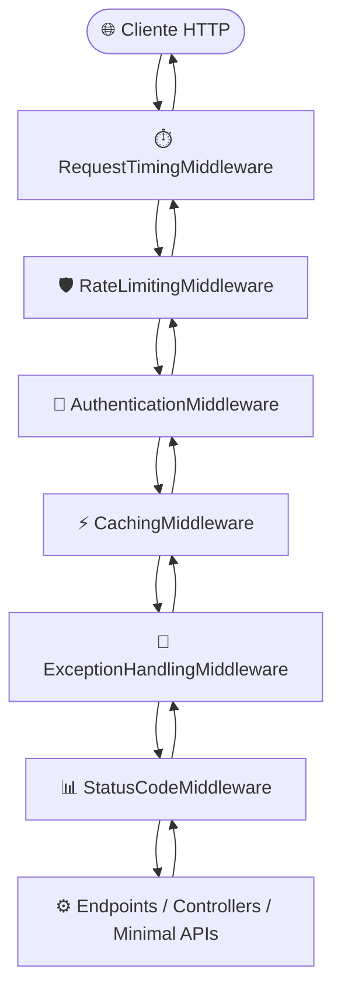

# ADR 006: Pipeline HTTP, Resiliência e Padronização de Erros RFC 7807 (TL.MiddlewareLibrary)

## 🎯 Contexto e Desafio Prático

Ao construir Web APIs e microsserviços em ASP.NET Core corporativos, é comum identificar duplicações e divergências de código defensivo em diversos projetos:
- Controllers e endpoints Minimal APIs repletos de blocos `try/catch` manuais.
- Cada endpoint retornando formatos díspares de falha (`{ erro }`, `{ message }`, `{ error_description }`), gerando atrito para integrações front-end e mobile.
- Falhas 500 vazando stack traces ou detalhes técnicos de persistência para clientes externos.
- Ausência de controle uniforme de taxa por IP, facilitando sobrecargas acidentais.
- Dificuldade para mensurar a latência real de ponta a ponta da requisição sem introduzir alocações no heap.

A **TL.MiddlewareLibrary** integra a suíte `TL.BuildingBlocks` para resolver essas dores direto no pipeline do ASP.NET Core, de forma leve, fluente e totalmente unificada com os contratos `Error` e `ValidationError` de `TL.BaseContracts`.

---

## 💡 Decisões Arquiteturais Consolidadas

### 1. Pipeline HTTP Unificado e Ordem Padronizada de Execução
Para garantir que cada middleware execute sua responsabilidade no momento exato do ciclo de vida da requisição (ida e volta), definimos a ordem padronizada a seguir:

1. **`RequestTimingMiddleware` na ponta exterior:** Mensura a duração completa do ciclo de vida da requisição, incluindo todo o pipeline e a action.
2. **`RateLimitingMiddleware` no início:** Bloqueia chamadas excessivas antes de qualquer processamento pesado.
3. **`AuthenticationMiddleware` antecipado:** Valida credenciais e formato do token antes do roteamento de negócio.
4. **`CachingMiddleware` antes da execução:** Entrega respostas em cache imediatamente para requisições idempotentes seguras (`GET`/`HEAD`), poupando CPU e banco de dados.
5. **`ExceptionHandlingMiddleware` e `StatusCodeMiddleware` próximos à aplicação:** Interceptam exceções de domínio e falhas não tratadas, formatando respostas estruturadas.

---

### 2. Medição de Latência com Zero Alocação (`RequestTimingMiddleware`)
- Utiliza `Stopwatch.GetTimestamp()` e `Stopwatch.GetElapsedTime()` nativos do .NET para medir o tempo decorrido com precisão de timestamp de alta resolução e **zero alocação de heap**.
- O tempo total é injetado no cabeçalho HTTP de resposta `X-Response-Time-Ms` via `context.Response.OnStarting()`.

---

### 3. Proteção contra Sobrecarga por IP (`RateLimitingMiddleware`)
- Limita o volume de chamadas por cliente em uma janela de tempo deslizante.
- Suporte a cabeçalho `X-Forwarded-For` para ambientes atrás de Load Balancers e Proxies Reversos.
- Implementação de `IDisposable` liberando o `Timer` de expiração para garantir zero vazamento de memória em aplicações com longo uptime.
- Em caso de estouro de cota, retorna status HTTP `429 (Too Many Requests)` em formato RFC 7807.

---

### 4. Padronização RFC 7807 com TL.BaseContracts (`ProblemDetailsResponse`)
- O modelo `ProblemDetailsResponse` adota as recomendações da RFC 7807 e RFC 9110, fornecendo:
  - `type`: URI identificadora do problema.
  - `title`: Título curto do status HTTP.
  - `status`: Código numérico HTTP.
  - `detail`: Explicação legível do erro.
  - `instance`: Caminho do endpoint disparador.
  - `traceId`: Identificador único de correlação (`X-Correlation-Id` ou `TraceIdentifier`).
  - `code`: Código padronizado de erro proveniente de `Error.Code` (ex: `Validation.General`, `User.NotFound`).
  - `errors`: Dicionário tipado de falhas campo a campo herdado de `ValidationError.Errors`.
- O `StatusCodeMiddleware` e o `ExceptionHandlingMiddleware` garantem que o cabeçalho `Content-Type: application/problem+json` seja sempre emitido.
