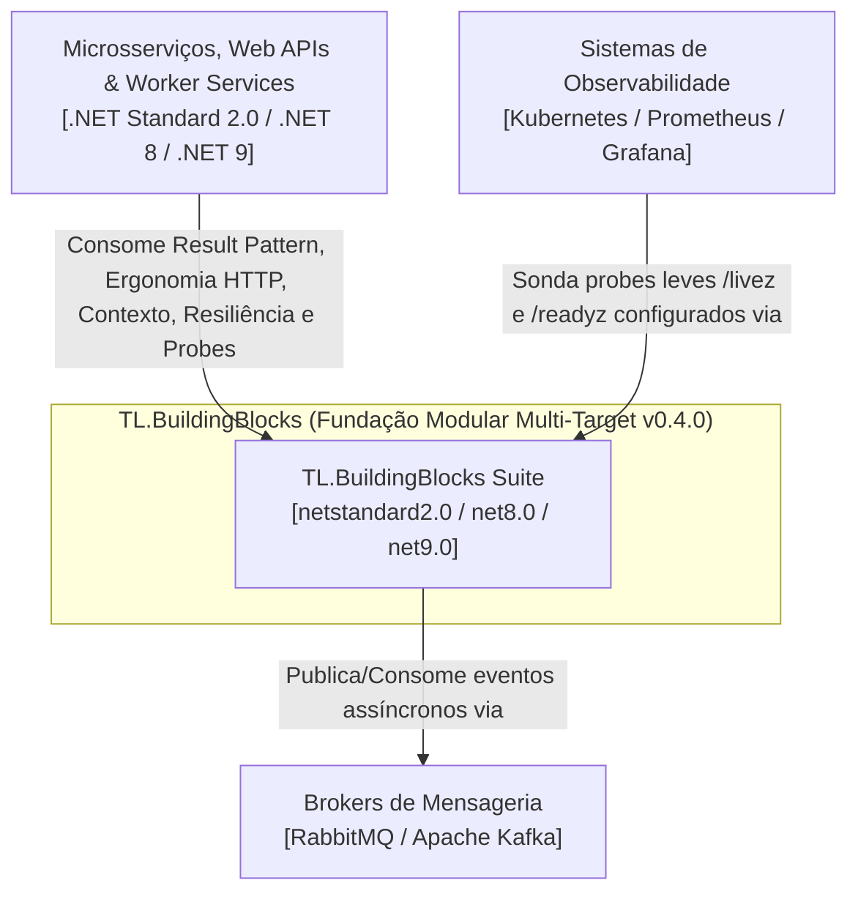
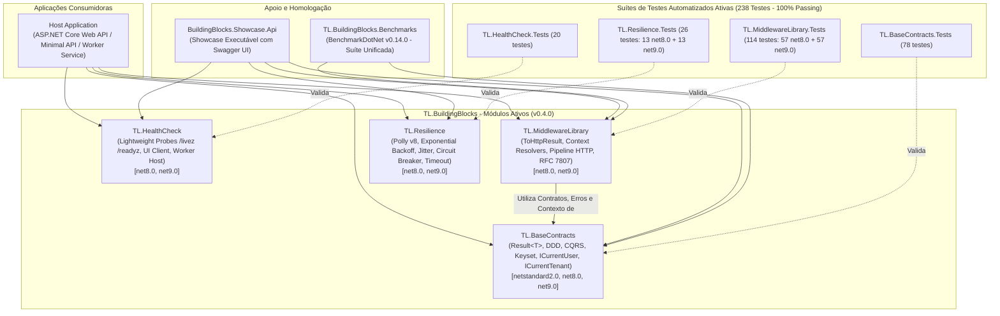

# Visão Geral da Arquitetura — TL.BuildingBlocks

## 📋 1. Resumo Executivo

O **TL.BuildingBlocks** é a fundação corporativa modular em C# projetada para fornecer blocos fundamentais de infraestrutura compartilhada, contratos padronizados de comunicação, ergonomia moderna e utilitários transversais para microsserviços, Web APIs e bibliotecas com amplo suporte a runtimes (.NET Standard 2.0, .NET 8 e .NET 9).

Na versão **v0.4.0**, a suíte abrange os seguintes módulos consolidados:
1. **Result Pattern, DDD, CQRS & Paginações (`TL.BaseContracts`)**: `Result<T>` funcional com `ErrorType`, `PagedResult<T>` e `SeekResult<T>` ($O(1)$ cursor pagination), primitivos DDD (`Entity`, `AggregateRoot`, `ValueObject`), semântica CQRS (`ICommand`, `IQuery`), abstrações de identidade e locatário (`ICurrentUser`, `ICurrentTenant`) e portas agnósticas de mensageria. **Zero dependências externas**.
2. **Sondas Leves e Health Checks Nativos (`TL.HealthCheck`)**: Probes padronizados de liveness (`/livez`) e readiness (`/readyz`) com serialização nativa ultrarrápida em `Utf8JsonWriter`, sem dependência de UI de terceiros e 100% compatível com AOT/trimming, além de suporte a UI Client e Worker Services.
3. **Ergonomia HTTP, Contexto & Middlewares (`TL.MiddlewareLibrary`)**: Bridge de 1 linha `result.ToHttpResult()` para Minimal APIs mapeando automaticamente para RFC 7807 (`ProblemDetails`), injeção de contexto via `IHttpContextAccessor` (`AddCurrentUser`, `AddCurrentTenant`), além de 6 middlewares (latência zero-alloc, rate limiting por IP, cache com pooling).
4. **Resiliência & Tolerância a Falhas com Polly v8 (`TL.Resilience`)**: Estratégias corporativas de retentativa exponencial com jitter decorrelacionado (`ResilienceHelper`), circuit breaker e timeout para chamadas externas e HttpClient (`AddStandardResilience`).
5. **Suíte Científica de Benchmarks (`TL.BuildingBlocks.Benchmarks`)**: Suíte unificada de performance com BenchmarkDotNet cobrindo contratos, primitivos de domínio, keyset pagination e pipeline HTTP com comprovação empírica de Zero-Allocation.
6. **Showcase & API Executável (`BuildingBlocks.Showcase.Api`)**: Exemplo executável completo com Swagger UI demonstrando a integração fim a fim dos blocos.

---

## 🏛️ 2. Diagramas C4

### 2.1 Nível 1: Diagrama de Contexto de Sistema (C4 Context)

### 2.2 Nível 2: Diagrama de Containers (C4 Container)

---

## 📦 3. Catálogo de Componentes e Projetos

| Projeto | Camada / Área | Target Frameworks | Dependências Nuget | Descrição & Responsabilidade |
| :--- | :--- | :--- | :--- | :--- |
| **`TL.BaseContracts`** | Contratos / Result Pattern / DDD | `netstandard2.0` `net8.0` `net9.0` | **Zero (BCL pura)** | Result Pattern (`Result<T>`, `ErrorType`), primitivos DDD (`Entity`, `AggregateRoot`, `ValueObject`), contratos CQRS, paginações (offset e keyset $O(1)$) e abstrações de contexto (`ICurrentUser`, `ICurrentTenant`). |
| **`TL.HealthCheck`** | Infra / Observabilidade | `net8.0` `net9.0` | `Microsoft.Extensions.Diagnostics.HealthChecks` *(FrameworkReference AspNetCore.App)* | Probes leves nativos `/livez` e `/readyz` com `Utf8JsonWriter` nativo (zero pacotes externos de UI, sem avisos AOT) e suporte a UI Client legado e Worker Services. |
| **`TL.MiddlewareLibrary`** | Pipeline HTTP / Ergonomia | `net8.0` `net9.0` | `TL.BaseContracts` *(FrameworkReference AspNetCore.App)* | Bridge `result.ToHttpResult()` para Minimal APIs RFC 7807, implementações de `ICurrentUser` e `ICurrentTenant` com `IHttpContextAccessor`, e 6 middlewares (latência zero-alloc, rate limiting, cache). |
| **`TL.Resilience`** | Resiliência / Tolerância a Falhas | `net8.0` `net9.0` | `Polly.Core` `Microsoft.Extensions.Http` | Resiliência corporativa com Polly v8 (Exponential Backoff, Decorrelated Jitter, Circuit Breaker, Timeout e extensão `.AddStandardResilience()` para `IHttpClientBuilder`). |
| **`TL.BuildingBlocks.Benchmarks`** | Performance / Benchmarks | `net8.0` `net9.0` | `BenchmarkDotNet` | Suíte unificada de medição científica com isolamento de processo e `MemoryDiagnoser` comprovando Zero Allocation. |
| **`BuildingBlocks.Showcase.Api`** | Demonstração / Executável | `net8.0` `net9.0` | Projetos da Solução | Web API executável demonstrando a integração completa com documentação interativa Swagger UI. |

---

## 🏛️ 4. Catálogo de Decisões Arquiteturais (ADRs)

- [**`ADR-000: Arquitetura e Convenções da Suíte TL.BuildingBlocks`**](../adr/ADR-000-arquitetura-e-convencoes.md)
- [**`ADR-001: Decisões Arquiteturais do Pacote TL.BaseContracts`**](../adr/ADR-001-tl-basecontracts.md)
- [**`ADR-002: Decisões Arquiteturais do Pacote TL.HealthCheck`**](../adr/ADR-002-tl-healthcheck.md)
- [**`ADR-003: Decisões Arquiteturais do Pacote TL.RabbitMQ`**](../adr/ADR-003-tl-rabbitmq.md)
- [**`ADR-004: Decisões Arquiteturais do Pacote TL.Kafka`**](../adr/ADR-004-tl-kafka.md)
- [**`ADR-005: Decisões Arquiteturais do Pacote TL.InvokePrivate`**](../adr/ADR-005-tl-invokeprivate.md)
- [**`ADR-006: Pipeline HTTP, Resiliência e Padronização de Erros RFC 7807 (TL.MiddlewareLibrary)`**](../adr/ADR-006-tl-middlewarelibrary.md)
- [**`ADR-007: Resiliência Padronizada com Polly v8 (TL.Resilience)`**](../adr/ADR-007-tl-resilience.md)
