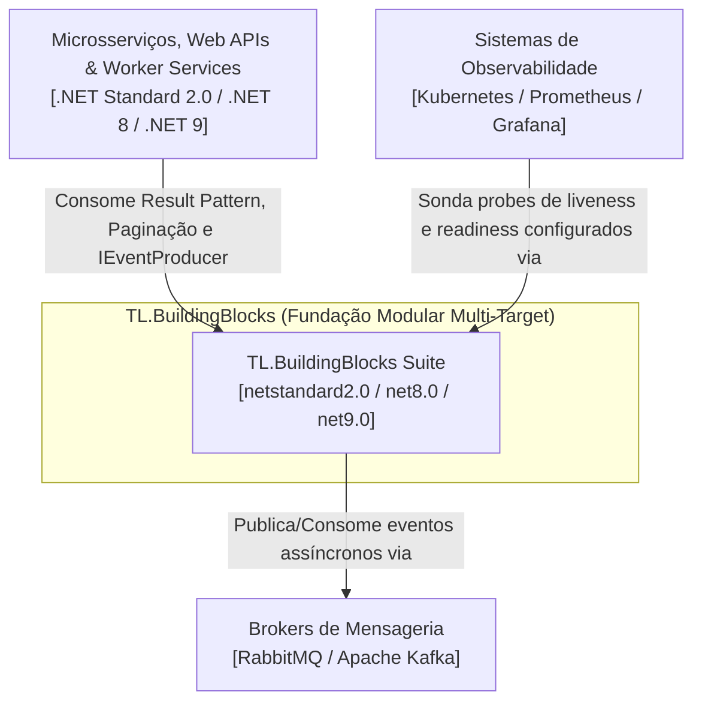
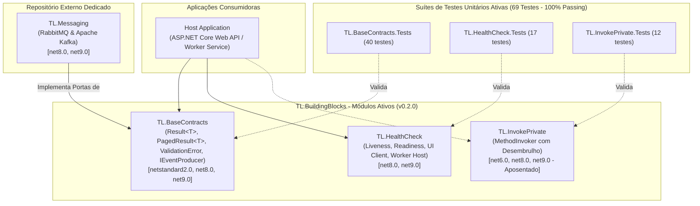

# Visão Geral da Arquitetura — TL.BuildingBlocks

## 📋 1. Resumo Executivo

O **TL.BuildingBlocks** é a fundação corporativa modular em C# projetada para fornecer blocos fundamentais de infraestrutura compartilhada, contratos padronizados de comunicação e utilitários transversais para microsserviços e bibliotecas com amplo suporte a runtimes (.NET Standard 2.0, .NET 8 e .NET 9).

A biblioteca abrange os seguintes módulos e suítes de testes unitários dedicadas:
1. **Result Pattern, Paginação & Contratos (`TL.BaseContracts`)**: `Result<T>` funcional com `ErrorType`, `PagedResult<T>` imutável, `ValidationError` por campo e portas agnósticas de mensageria (`IEventProducer`, `IEventHandler<T>`, `EventMessage<T>`). **Zero dependências externas**.
2. **Configuração de Health Checks Padronizados (`TL.HealthCheck`)**: Extensões fluentes para configuração de liveness (`/liveness`), readiness (`/ready`) e dashboard (`/health`) com suporte a UI Client e Worker Services.
3. **Adaptador RabbitMQ (`TL.RabbitMQ`)**: Implementação resiliente AMQP de `IEventProducer` e `IRabbitMqProducer` com Publisher Confirms, Dead-Letter Queue (`.dlq`) automática e Polly (migrado para `TL.Messaging`).
4. **Adaptador Apache Kafka (`TL.Kafka`)**: Implementação resiliente de `IEventProducer` e `IKafkaProducer` com Partition Keys para ordenação, idempotência nativa e Dead Letter Topic (`.dlt`) (migrado para `TL.Messaging`).
5. **Invocação Dinâmica de Membros Privados (`TL.InvokePrivate`)**: Utilitário baseado em Reflection para testes e suporte a legados com desembrulho de `TargetInvocationException` (descontinuado).

---

## 🏛️ 2. Diagramas C4

### 2.1 Nível 1: Diagrama de Contexto de Sistema (C4 Context)

### 2.2 Nível 2: Diagrama de Containers (C4 Container)

---

## 📦 3. Catálogo de Componentes e Projetos

| Projeto | Camada / Área | Target Frameworks | Dependências Nuget | Descrição & Responsabilidade |
| :--- | :--- | :--- | :--- | :--- |
| **`TL.BaseContracts`** | Contratos / Result Pattern | `netstandard2.0` `net8.0` `net9.0` | **Zero (BCL pura)** | Result Pattern (`Result<T>`, `ErrorType`), paginação imutável (`PagedResult<T>`, `PagedRequest`), `ValidationError` e portas de mensageria (`IEventProducer`, `IEventHandler<T>`). |
| **`TL.HealthCheck`** | Infra / Observabilidade | `net8.0` `net9.0` | `AspNetCore.HealthChecks.UI.Client` `Microsoft.Extensions.Diagnostics.HealthChecks` | Métodos de extensão para probes `/health`, `/ready` e `/liveness` em Web APIs e Worker Services. |
| **`TL.RabbitMQ`** *(Migrado)* | Infra / Mensageria | `net8.0` `net9.0` | `RabbitMQ.Client` `Polly` | Adaptador AMQP (promovido na v0.2.0 para o repositório dedicado [`TL.Messaging`](https://github.com/thaylonlopes/TL.Messaging)). |
| **`TL.Kafka`** *(Migrado)* | Infra / Mensageria | `net8.0` `net9.0` | `Confluent.Kafka` `Polly` | Adaptador Apache Kafka (promovido na v0.2.0 para o repositório dedicado [`TL.Messaging`](https://github.com/thaylonlopes/TL.Messaging)). |
| **`TL.InvokePrivate`** *(Aposentado)* | Utilitários / Reflection | `net6.0` `net8.0` `net9.0` | **Zero (BCL pura)** | Invocação de métodos privados para legados. Descontinuado na v0.2.0 (`<IsPackable>false</IsPackable>`) e marcado como `[Obsolete]`. |

---

## 🏛️ 4. Catálogo de Decisões Arquiteturais (ADRs)

> **Nota de Governança e Rastreabilidade:** As ADRs 003 e 004 são mantidas neste repositório como registro histórico imutável das decisões que deram origem aos adaptadores de mensageria antes de sua promoção para o repositório dedicado `TL.Messaging`.

- [**`ADR-000: Arquitetura e Convenções da Suíte TL.BuildingBlocks`**](../adr/ADR-000-arquitetura-e-convencoes.md)
- [**`ADR-001: Decisões Arquiteturais do Pacote TL.BaseContracts`**](../adr/ADR-001-tl-basecontracts.md)
- [**`ADR-002: Decisões Arquiteturais do Pacote TL.HealthCheck`**](../adr/ADR-002-tl-healthcheck.md)
- [**`ADR-003: Decisões Arquiteturais do Pacote TL.RabbitMQ`**](../adr/ADR-003-tl-rabbitmq.md) *(Histórico — Promovido para TL.Messaging)*
- [**`ADR-004: Decisões Arquiteturais do Pacote TL.Kafka`**](../adr/ADR-004-tl-kafka.md) *(Histórico — Promovido para TL.Messaging)*
- [**`ADR-005: Decisões Arquiteturais do Pacote TL.InvokePrivate`**](../adr/ADR-005-tl-invokeprivate.md) *(Histórico — Aposentado na v0.2.0)*
